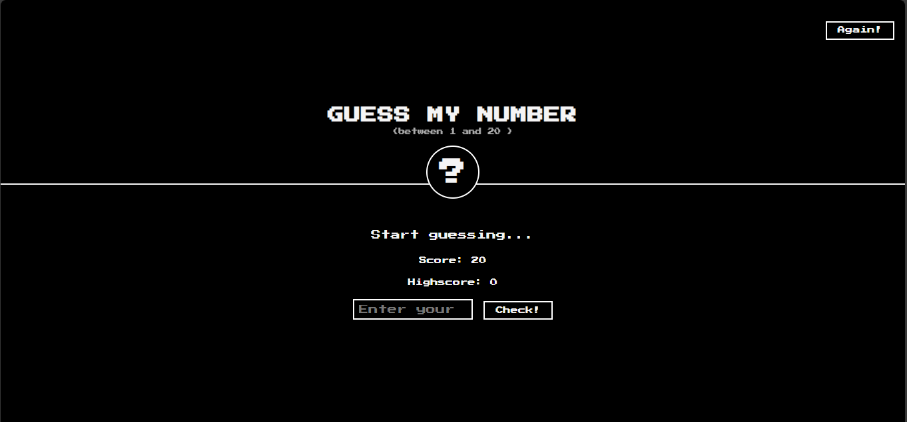

<<<<<<< HEAD
# Guess The Number Game

This is a simple web-based game where the user tries to guess a randomly generated number between 1 and 20. After each guess, feedback is given whether the guess was too high or too low.

---

## How to Play

1. Enter a number between 1 and 20.
2. Click the "Check" button.
3. You will receive hints whether the number is too high or too low.
4. The score decreases with each wrong attempt.
5. The game ends when the correct number is guessed or the score reaches 0.

---

## Output Screenshot

=======

>>>>>>> 1087cc69f9232bc154db70e03175f0360c4d3615
